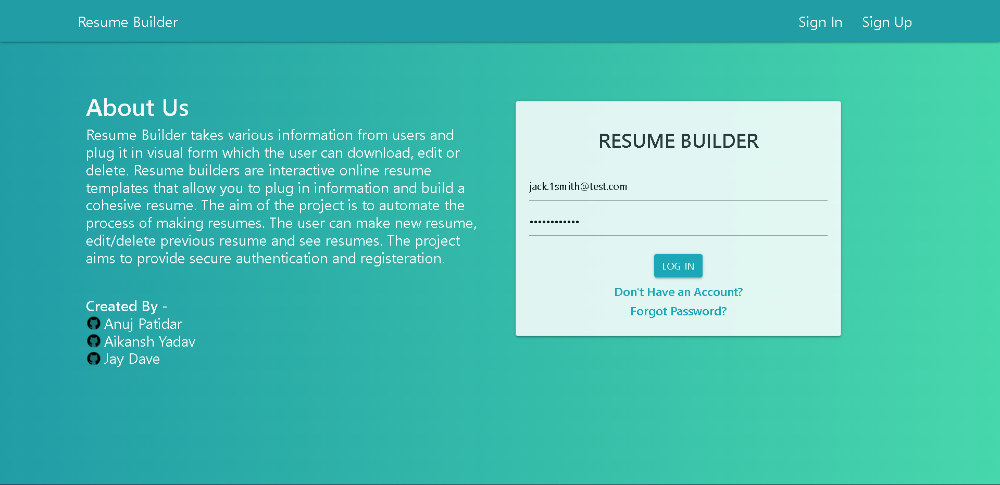
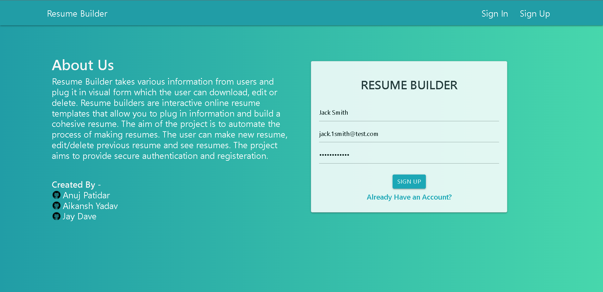
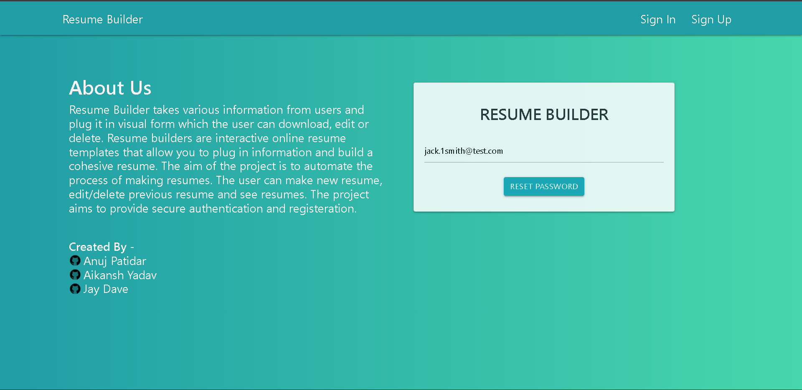
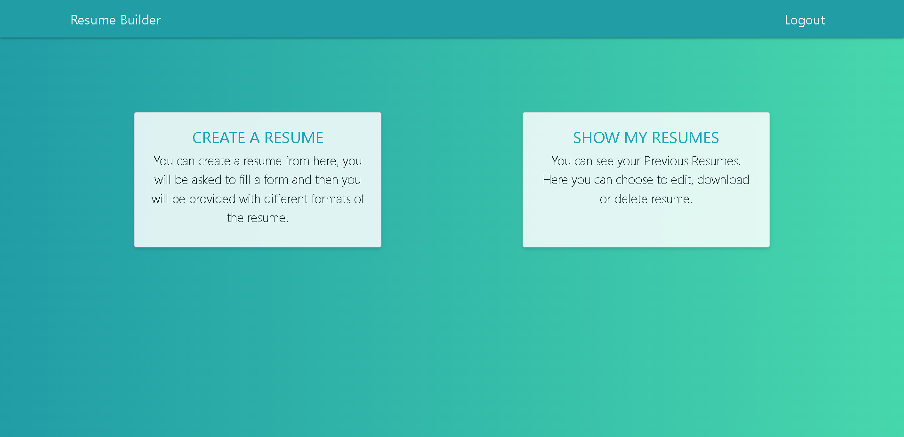
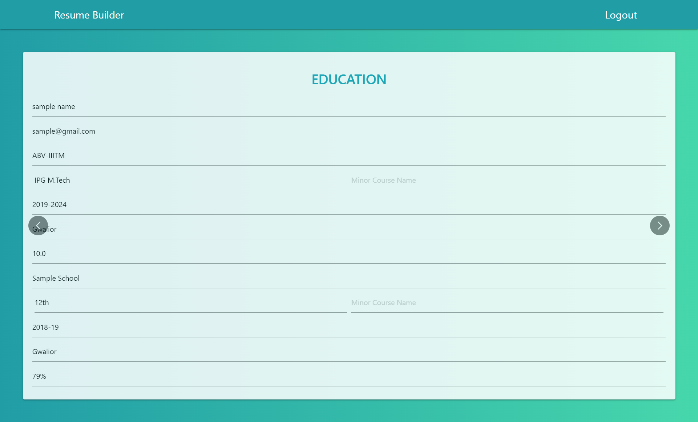
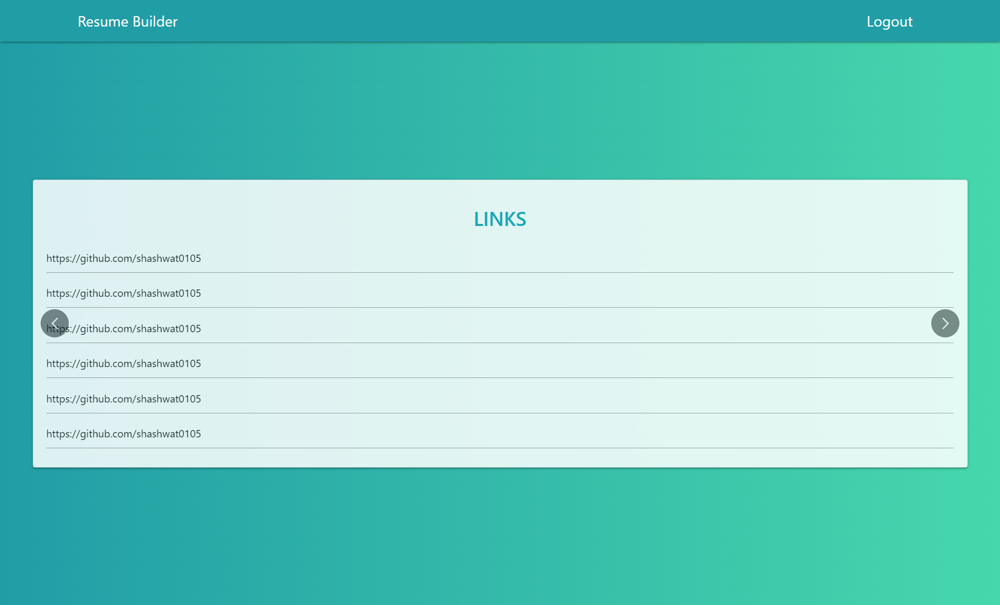
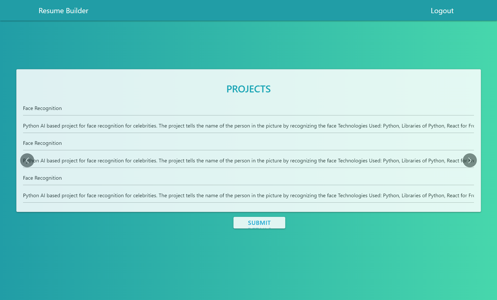
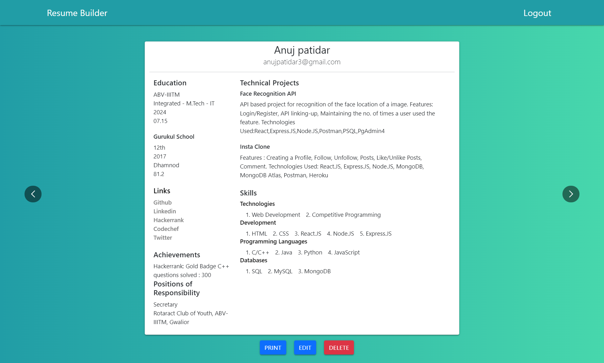
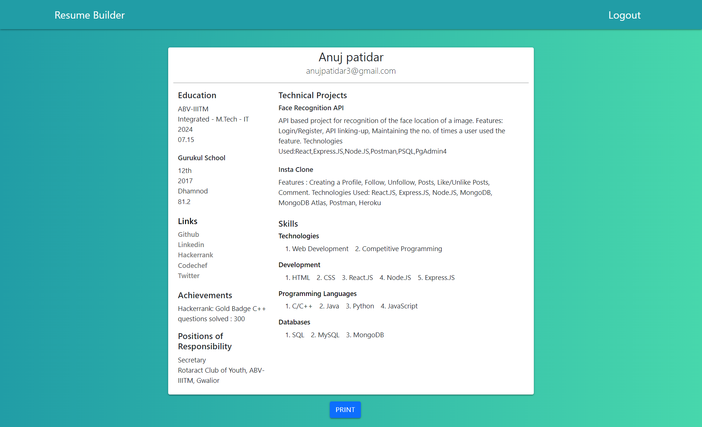

# Resume-Builder
Resume Builder takes various information from users and plug it in visual form which the user can download, edit or delete. Resume builders are interactive online resume templates that allow you to plug in information and build a cohesive resume.

It is a web based application which automates the process of making resumes. It provides various templates for building resumes.
Various templates will be made available to the user for making a resume. It also has an ability to save a resume so that the user can edit the resume, make another resume and download the resume. It also provides the ability to delete already existing resumes.The application provides authentication and privacy capabilities to the user. All data of the user will be stored in an online database and will be protected so that no user without proper credentials can access it.

## Installation and Setup Instructions
Clone down this repository. You will need `node` and `npm` installed globally on your machine.  

Deployment link:

[Resume Builder Application](https://resume-builder71943.herokuapp.com/)

Installation:

* Client side: `npm install`   
* Server side: `npm install`

To Start App:

* Client side: `npm start`
* Server side: `node app.js`

To Visit App:

`localhost:3000/`  

## Design

* Sign In Screen: 
  

  
  

  
 * Sign Up Screen:
   

   
   

   
 * Reset Password Screen:
   

   
   

   
 * Dasboard Screen:
   

   
   

   
 * Create Resume:
 
    - **Education Form Screen:** 
      

      
      

      
     - **Skills Form Screen:** 
       

       
       

       
     - **Links Form Screen:** 
        

        
        
 
  
      - **Projects Form Screen:**
         

         
         
 
         
         
 * Show/Edit/Delete Resume Screen:
   

   
   

         
 * Print Resume Screen:
   

   
   
   
  

## Technologies Used
* [HTML](https://devdocs.io/html/): It is the code that is used to structure a web page and its content.
* [CSS](https://devdocs.io/css/): It is a style sheet language used for describing the presentation of a document written in a markup language such as HTML.
* [React.Js](https://github.com/reactjs/reactjs.org "Reactjs") : It makes it painless to create interactive UIs. Design simple views for each state in your application, and React will efficiently update and render just the right components when your data changes.
* [Node.Js](https://github.com/nodejs/node "NodeJs"): It is an open-source, cross-platform, back-end JavaScript runtime environment that runs on the V8 engine and executes JavaScript code outside a web browser.
* [Express.Js](https://expressjs.com/en/5x/api.html): It is a minimal and flexible Node.js web application framework that provides a robust set of features for web and mobile applications.
* [MongoDB](https://docs.mongodb.com/ "MongoDB"): It is a document database with the scalability and flexibility that you want with the querying and indexing that you need
* [Redux](https://github.com/reduxjs/redux "Redux"): It helps us to write applications that behave consistently, run in different environments (client, server, and native), and are easy to test.
* [Javascript](https://devdocs.io/javascript/): It is a text-based programming language used both on the client-side and server-side that allows you to make web pages interactive.

# Team Members

Student Name | Roll No.
---|---
Aikansh Yadav | 2019IMT-007
Anuj Patidar | 2019IMT-019
Jay Dave | 2019IMT-043
